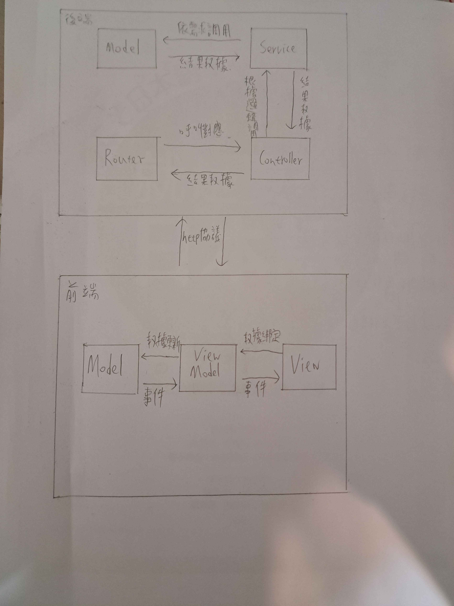
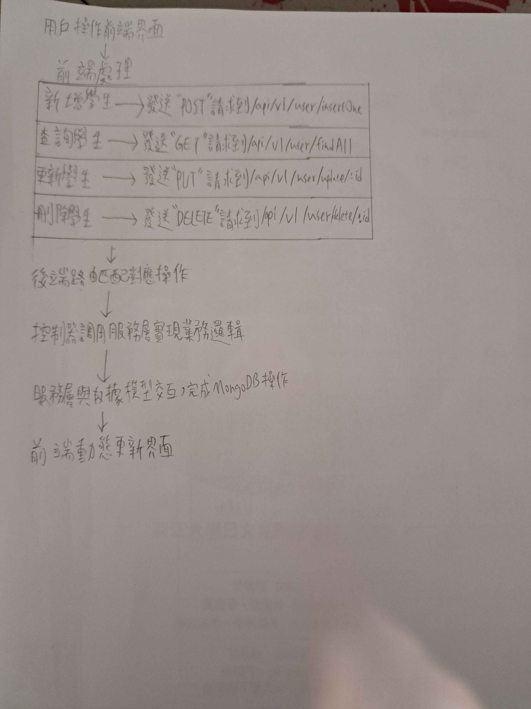

 # StudentHub專案
 
 1.安裝與執行
*前端開發 : React + ts
*後端開發 : Node.js + Express
*資料庫 : MongoDB
*API測試 : PostMan
*安裝套件 : npm

2.API規格說明（請求方式及回應）
*瀏覽:在瀏覽器中打開 http://localhost:5173 來使用。
*GET方法:根據學生的座號、姓名進行查詢
*POST方法:新增一筆學生資料
*DELETE方法:根據帳號刪除一筆學生資料
*PUT方法:根據帳號更新學生名子
3.架構圖
*

4.流程圖
*
